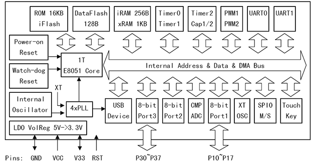

# [CH552](https://github.com/sochub/CH552) 
 
####  qitas@qitas.cn
#### 父级：[CH55系列](https://github.com/sochub/CH55)
#### 归属：[8051](https://github.com/sochub/8051) 

## [芯片简介](https://github.com/sochub/CH552/wiki)

CH552芯片是一款兼容MCS-51指令集的增强型E8051内核单片机，其79%的指令是单字节单周期指令，平均指令速度比标准MCS-51快8～15 倍。

CH552 支持最高24MHz 系统主频，内置16K 程序存储器ROM 和256 字节内部iRAM 以及1K 字节片内xRAM，xRAM 支持DMA直接内存存取。

CH552内置了ADC 模数转换、触摸按键电容检测、3 组定时器和信号捕捉及PWM、双异步串口、SPI、USB设备控制器和全速收发器、USB type-C等功能模块。

 

### [资源组成](https://github.com/sochub/CH552)

* [参考文档](docs/)
	* [芯片手册](docs/CH552.PDF)
* [参考资源](src/)
	* [引用资源](src/include)
	* [参考资源](src/examples)
* [模板工程](demo/)
	* [LCD设备](demo/LCD)
	* [HID设备](demo/HID)
	
### [替换方案](https://github.com/sochub/CH552)

更多功能接口或无线集成可选[CH56系列](https://github.com/sochub/CH56)或[CH57系列](https://github.com/sochub/CH57)替换，同厂方案

2倍左右性能和资源增幅可选[CH558](https://github.com/sochub/CH558)或[CH559](https://github.com/sochub/CH559)替换，提供LQFP48封装

相同规格成本略高替换可选[CH554](https://github.com/sochub/CH554)，全面升级替换可选[CH54系列](https://github.com/sochub/CH54)

### [芯片应用](https://github.com/sochub/CH552)

* [OS-Q：USB管道设备L](https://github.com/OS-Q/D95)

### [项目参考](https://github.com/sochub/CH552)

##  [SoC开发平台](http://www.qitas.cn)  

