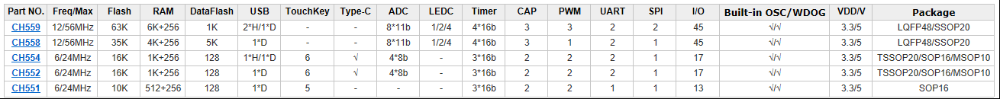

# [CH552](https://github.com/SoCXin/CH552)

#### [Vendor](https://github.com/SoCXin/Vendor)：[WCH](https://github.com/SoCXin/WCH)
#### [Core](https://github.com/SoCXin/8051)：[E8051](https://github.com/SoCXin/8051)
#### [Level](https://github.com/SoCXin/Level)：6/24MHz

## [CH552简介](https://github.com/SoCXin/CH552/wiki)

[CH552](https://github.com/SoCXin/CH552) 是一款兼容MCS-51指令集的增强型E8051内核单片机，其79%的指令是单字节单周期指令，平均指令速度比标准MCS-51快8～15倍。

支持最高24MHz 系统主频，内置16K 程序存储器ROM 和256 字节内部iRAM 以及1K 字节片内xRAM，xRAM 支持DMA直接内存存取。

内置了ADC 模数转换、触摸按键电容检测、3 组定时器和信号捕捉及PWM、双异步串口、SPI、USB设备控制器和全速收发器、USB type-C等功能模块。

* 芯片封装：TSSOP20、MSOP10、QFN16

### [资源收录](https://github.com/SoCXin/CH552)

* [参考文档](docs/)
* [参考资源](src/)
* [参考工程](project/)
* [相关工具](tools/)

### [选型建议](https://github.com/SoCXin)

[CH552](https://github.com/SoCXin/CH552) 是 8051 USB单片机中的低成本方案，性价比高，相同规格略提升替换可选[CH554](https://github.com/SoCXin/CH554)，降低规格可选[CH551](https://github.com/SoCXin/CH551)，更高性能的替换可选2倍左右性能和资源增幅的[CH558](https://github.com/SoCXin/CH558) 或 [CH559](https://github.com/SoCXin/CH559)。

##  [SoC资源平台](http://www.qitas.cn)
